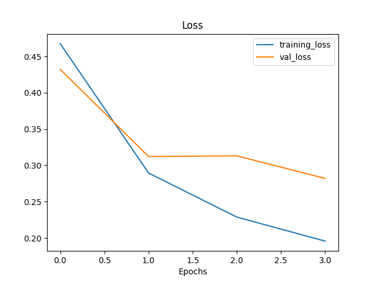
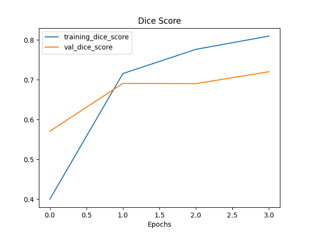

Implementation containing model architecture such as a simple U-Net for image semantic segmentation.

**_Project have that files_**:
- **cfg/config.yaml** -- for storing config variables for model.
- **train.py** -- it's core code file for model training.
- **inference.py** -- it's core code file for predictions.
- **model_builder.py** -- file with function for building model with Keras functional API and classes of custom
- metric and loss function.
- **training_process.py** -- file with function for training model.
- **get_prediction.py** -- file with function for predictions.
- **data_handler.py** -- file with class for building batch with images and masks.
- **utils.py** -- file with all support functions.
- **requirements.txt** -- file which store name all libraries that require for this project.

---

## Model Architecture

Model architecture has:
- Input layer with shape=(160, 160)
- data_augmentation layer (for augmented data only in training process)

And standard U-Net architecture from code example in 
Keras documentation ([Image Segmentation with a U-Net-like architecture](https://keras.io/examples/vision/oxford_pets_image_segmentation/#prepare-unet-xceptionstyle-model)):

---

## Downloading and testing model

First get the repository
```commandline
git clone https://github.com/savchoa/WINSTARS_AI_airbus_ships_challenge
```
Next you need step into repo directory
```commandline
cd WINSTARS_AI_airbus_ships_challenge
```
Next create new python environment (my python is 3.10).
```commandline
python -m venv venv
```
Activate new environment
```commandline
./venv/Scripts/activate
```
And install all requirements
```commandline
pip install -r requirements.txt
```
Then download the dataset from https://www.kaggle.com/competitions/airbus-ship-detection/data
and put it to `input/dataset` directory.

The directory `models/trained/weights` already has trained model`s weights. 
If you want train new model:
- set the parameters for trainig in **cfg/config.yaml**
- move out files of weight from path `models/trained/weights/*`
```commandline
mv models/trained/weights/* your/path/for/my/weights/*
```
And next run `train.py`

---

If you want to get prediction on images from test dataset (do not seen during training):
- set the parameters for prediction in **cfg/config.yaml** (predict_batch_number, predict_image_number)
- run `inference.py`
You will see the result of prediction: source image, predicted mask, combination(source image + predicted mask).
Source image and predicted mask are saved to "../output/results/". 

## Results

In order not to wait a long time for the training result, 
only 30% of the images from those with a ground-truth mask were used.
As a loss function dice loss was used. Dice_score was used as metric for model evaluation.
For the training were used hyperparameters:
- learning_rate = 0.001
- batch size = 22

In result of training, I got this:
- dice_loss = 0.1890
- dice_score = 0.8150
- val_dice_loss = 0.3031
- val_dice_score = 0.7109

And got this curves of loss and dice score:

**Dice Loss Function**



**Dice Score Metric**



### Ways to improve results:

1. As it was shown in EDA.ipynb, one of the problems with this task is severe data imbalance. 
Even if we consider only images with ships, the ratio of mask pixels to the total number of pixels is ~1:1000.
If images without ships are included, this ratio is much more, which is quite difficult to process. 
Therefore, for better results we shold remove all images without ships from training dataset, which makes it more balanced.
2. Using the pipeline with two steps. On the first step we use ship/no-ship classification model. 
If no-ship result, the pipeline returns empty mask. If ship result, on the second step we use segmentation model.
3. Using fine-tuned part of classification model (on ship/no-ship dataset) as backbone in segmentation model.
4. Using more advanced architectures. Presently VLTSeg net is SOTA in semantic segmentation
(see here https://paperswithcode.com/sota/semantic-segmentation-on-cityscapes).       
